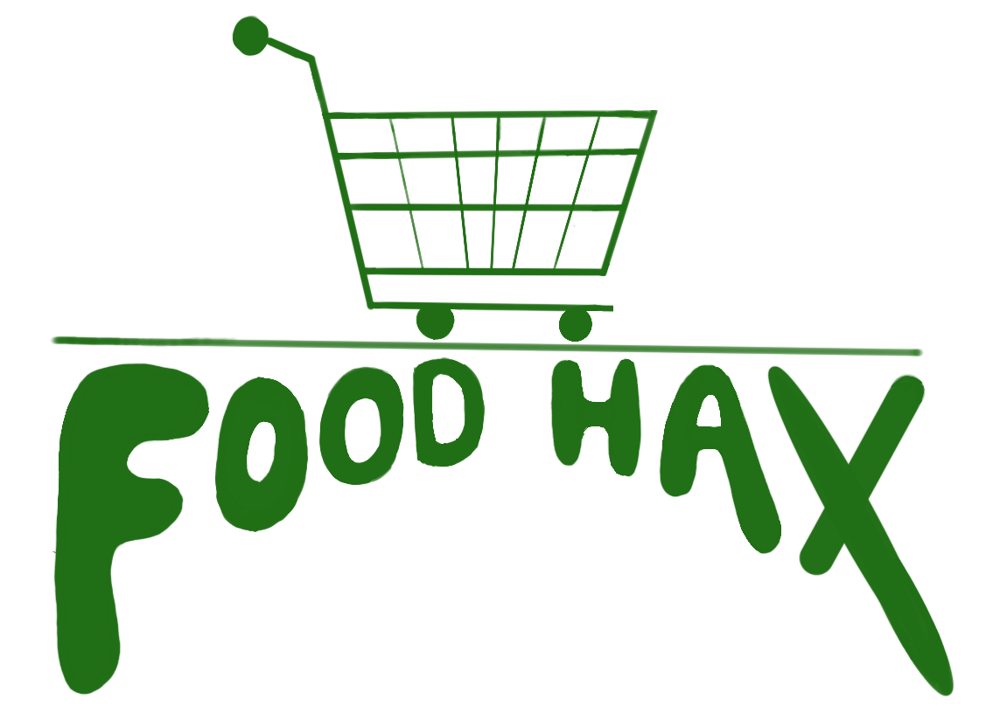

# [SteelHacks](https://steelhacks.org/) XII
### Team bbgurl presents

> What if there was a resource that took away the stress of research by organizing food pantries and banks in the Pittsburgh area? Introducing Foodhax: tackling food inequality, one click at a time.

## Table of Contents
- [Team](#team)
- [Project](#project)
- [Tracks](#tracks)
- [Install](#install)

### Team 
- Andrew Gambino ang525@pitt.edu
- Olivia Mobley olm95@pitt.edu
- Mei Satler mls410@pitt.edu
- Katya Surendran kcs120@pitt.edu

### Project

Why Food Hax?

We wanted to create a free resource that organized important information-- the location of food banks and pantries in the Pittsburgh area-- to benefit everyone in the community. Often, it can be a struggle to find organized information so for an issue as important as this, our number-one priority was making sure anyone, no matter who they are, could access this website to find the closest food pantry in their area.

How?

To create our website, we had two people working on the frontend and two people on the backend at the same time to maximize efficiency. For the frontend, HTML, CSS, and embedded JS were used for our design. Figma was used to design the layout of our pages. The logo was created in procreate. On the backend, Python's Django framework was used to link our files together.

Overcoming Challenges

The biggest challenge for our beginner team was learning how to use and incorporate Google API, as none of us had had experience with API keys before. As such, it was a struggle to incorporate its various features and troubleshoot various issues that initially popped up such as the map struggling to load or getting the directions to work properly. However, through perseverance, team work and talking to others with experience, we were able to compile everything correctly for success.

Food Hax's Future

If given the chance to expand, we would add _a lot_. For better scalability, we would incorporate a side for the food pantries to update their stock, essentially creating a continuously updating database that users can then check to view what is available at local food banks. Additionally, we could add a comments and review section for logged-in users to give reviews on their experiences at the food banks. 

Source of pantry location data: [Greater Pittsburgh Community Food Bank](https://pittsburghfoodbank.org/)

### Tracks
Food Hax is on the Civics and Accessibility, and Product Design tracks. The nature of Food Hax aims to make invaluable resources more easily available to the community, improving overall quality of life. Additionally, we strive to make Food Hax as user-friendly and as aesthetically pleasing as possible.

### Install
Clone the repo on your local machine: `git clone https://github.com/username/repository-name.git`

Navigate to the repo: `cd repository-name`

Create a virtual environment: (windows) `python -m venv venv` (linux) `python3 -m venv venv`

Activate your venv: (windows) `.\venv\Scripts\activate` (linux) `source venv/bin/activate`

Install dependencies: `pip install -r requirements.txt` (file in root)

Run the server: `python manage.py runserver`
